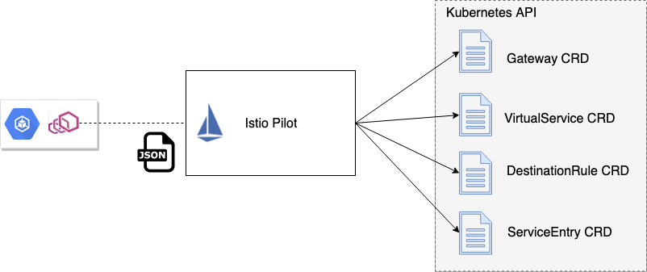
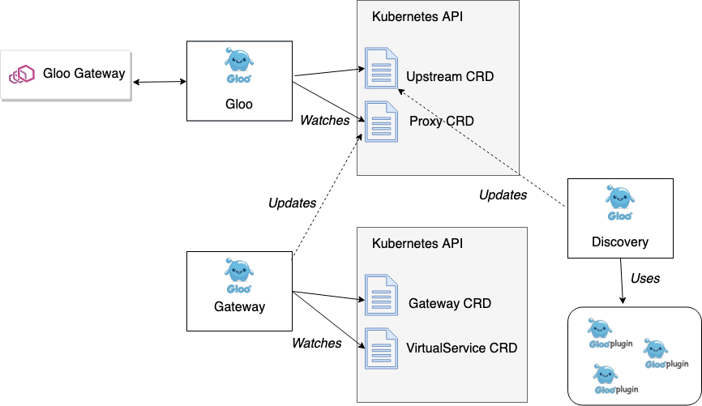

查看原文：<https://medium.com/solo-io/guidance-for-building-a-control-plane-for-envoy-part-3-domain-specific-configuration-c97e8124b9d1>。

这是探索为 Envoy 代理构建控制平面系列文章的第3部分。

在本系列博客中，我们将关注以下领域:

- [采用一种机制来动态更新 Envoy 的路由、服务发现和其他配置](https://medium.com/solo-io/guidance-for-building-a-control-plane-to-manage-envoy-proxy-at-the-edge-as-a-gateway-or-in-a-mesh-badb6c36a2af)
- [确定控制平面由哪些组件组成，包括支持存储、服务发现 api、安全组件等](https://medium.com/solo-io/guidance-for-building-a-control-plane-for-envoy-proxy-part-2-identify-components-2d0731b0d8a4)
- 建立最适合您的使用场景和组织架构的特定于域的配置对象和 api（本博客）
- 考虑如何最好地使您的控制平面可插在您需要它的地方
- 部署各种控制平面组件的选项
- 通过控制平面的测试工具来思考

在前面的[博客部分](https://medium.com/solo-io/guidance-for-building-a-control-plane-for-envoy-proxy-part-2-identify-components-2d0731b0d8a4)中，我们评估了控制平面可能需要的组件。在本节中，我们将探索特定于域的 API 在您的控制平面上可能是什么样子的。

## 建立您的控制平面交互点和 API 面

一旦您考虑了哪些组件可能构成您的控制平面体系结构(请参阅前面的部分)，您就需要考虑您的用户将如何与控制平面交互，甚至更重要的是，您的用户将是谁?要回答这个问题，您必须决定基于 Envoy 的基础设施将扮演什么角色，以及流量将如何通过体系结构。它可以是：

- API 管理网关（南北向流量）
- 简单 Kubernetes 边缘负载均衡器/反向代理/入口控制（南北向流量）
- 共享服务代理（东西向流量）
- 每个服务的 sidecar（东西向流量）

Istio 项目旨在成为服务网格平台，用户通过平台，可以在此基础上构建工具来驱动服务和应用程序之间的网络控制。Istio 用于配置 Envoy 的领域特定配置对象主要围绕以下对象：

- [Gateway](https://istio.io/docs/reference/config/networking/)：定义一个共享代理组件（能够集群进入），该组件指定可用于负载均衡和路由流量的协议、TLS、端口和主机/权限
- [VirtualService](https://istio.io/docs/reference/config/networking/)：如何与特定服务交互的规则；可以指定诸如路由匹配、超时、重试等内容
- [DestinationRule](https://istio.io/docs/reference/config/networking/)：如何与特定服务进行交互的规则，包括熔断、负载均衡、mTLS 策略、服务的子集定义等
- [ServiceEntry](https://istio.io/docs/reference/config/networking/)：显式地将服务添加到 Istio 的服务注册中心

运行在 Kubernetes 中的所有这些配置对象都实现为 [CustomResourceDefinitions](https://kubernetes.io/docs/concepts/extend-kubernetes/api-extension/custom-resources/)。

[Heptio/VMWare Contour](https://github.com/heptio/contour) 旨在作为 Kubernetes ingress 网关，并具有一个简化的特定于域的配置模型，具有 CustomResourceDefinition （CRD）风格和 [Kubernetes ingress 资源](https://kubernetes.io/docs/concepts/services-networking/ingress/)：

- [IngressRoute](https://github.com/heptio/contour/blob/master/docs/ingressroute.md) 是一个 Kubernetes CRD，它提供一个位置来指定 Contour 代理的配置
- [Ingress 资源支持](https://github.com/heptio/contour/blob/master/docs/annotations.md)，允许你在你的 Kubernetes Ingress 资源上指定注解。

在 [Gloo 项目](https://gloo.solo.io/)中，将可用的配置对象分成两个级别：

- 为用户提供最佳符合人机工程学的面向用户的配置，并为可扩展性留下选项（下一节将详细介绍）
- 抽象 Envoy 但不明确用于直接用户操作的低层配置。较高级别的对象被转换为这种较低级别的表示形式，最终用于转换为 Envoy xDS api。这样设计的原因将在下一节中说明

对于用户，Gloo 关注拥有路由配置的团队，因为路由的语义（以及可用的转换/聚合功能）受到 API 和微服务开发人员的严重影响。对于面向用户的 API 对象，我们使用：

- [Gateway](https://gloo.solo.io/v1/github.com/solo-io/gloo/projects/gateway/api/v1/gateway.proto.sk/)：指定特定监听器端口上可用的路由和 API 端点，以及每个 API 的安全性
- [VirtualService ](https://gloo.solo.io/v1/github.com/solo-io/gloo/projects/gateway/api/v1/virtual_service.proto.sk/)：将 API 路由分组到一组“虚拟 API”中，这些“虚拟 API”可以路由到支持的函数（gRPC、http/1、http/2、lambda 等）；使开发人员能够控制路由如何处理[不同的转换]()，从而尝试将前端 API 与后端 API（以及后端可能引入的任何破坏性更改）分离开来

注意，这些对象与这些对象的 Istio 变体不同。

Gloo 中的面向用户的 API 对象驱动较低层的对象，这些对象最终用于派生 Envoy xDS 配置。例如，Gloo 的底层核心 API 对象是：

- [Upstream](https://gloo.solo.io/v1/github.com/solo-io/gloo/projects/gloo/api/v1/upstream.proto.sk/)：获取关于后端集群和在此上公开的函数的详细信息。您可以将 Gloo 上游与 [Envoy 集群](https://www.envoyproxy.io/docs/envoy/latest/api-v2/api/v2/cds.proto)松散地关联起来，但有一个很大的区别:上游可以理解特定端点上可用的实际服务功能（换句话说，了解 `/foo/bar` 和 `/bar/wine`，包括它们的预期参数和参数结构，而不仅仅是 `hostname:port`），后文会详细解释。
- [Proxy](https://gloo.solo.io/v1/github.com/solo-io/gloo/projects/gloo/api/v1/proxy.proto.sk/)：代理是抽象我们可以应用于 Envoy 的所有配置的主要对象。这包括监听器、虚拟主机、路由和上行流。高级对象（VirtualService，Gateway等）用于驱动这个低级代理对象。

Gloo 控件的两层配置之间的分离允许我们在保持配置 Envoy 的简单抽象的同时扩展 Gloo 控制平面功能。本系列的第 4 部分将对此进行更详细的解释。

在前面的三个示例中（Istio、Contour、Gloo），每个控制平面公开一组特定于域的配置对象，这些对象以用户为中心，但最终转换为 Envoy 配置，并通过 xDS 数据面 API 公开。这提供了 Envoy 与用户的工作方式及其工作流之间的解耦。尽管我们已经看到了一些为抽象 Envoy 创建更关注用户和工作流的领域特定配置的例子，但这并不是构建 Envoy 控制平面的唯一方法。[Booking.com 有一个很棒的演示](https://www.slideshare.net/IvanKruglov/ivan-kruglov-introducing-envoybased-service-mesh-at-bookingcom-version-7)，介绍了他们是如何与 Envoy 配置保持更紧密的联系，并使用一个引擎将所有不同团队的配置片段合并到实际的 Envoy 配置中。

除了考虑特定于域的配置之外，还应该考虑 API/对象模型的特定接触点。例如，Kubernetes 非常关注 YAML 和资源文件。您可以构建一个更特定于领域的 CLI 工具（就像 [OpenShift 对 oc CLI](https://docs.openshift.com/enterprise/3.2/dev_guide/new_app.html#dev-guide-new-app) ，[Istio 对 istioctl](https://istio.io/docs/reference/commands/istioctl/) ， [Gloo 对 glooctl](https://gloo.solo.io/cli/glooctl/) 所做的那样）。

## 小结

当您构建一个 Envoy 控制平面时，您是带着一个特定的意图或一组架构/用户来做这件事的。您应该考虑到这一点，并构建适合您的用户并改进您的 Envoy 操作工作流使其符合人体工程学的、有主见的特定于领域的 API。[Gloo 团队](https://github.com/solo-io/gloo/graphs/contributors)建议研究现有的 Envoy 控制平面实现，只有在其他实现都不合适的情况下才构建自己的 Envoy 控制平面。Gloo 的控制为扩展和定制奠定了基础。我们将在下一篇文章中看到，可以构建一个完全可扩展的控制平面，以适应许多不同的用户、工作流和操作约束。
