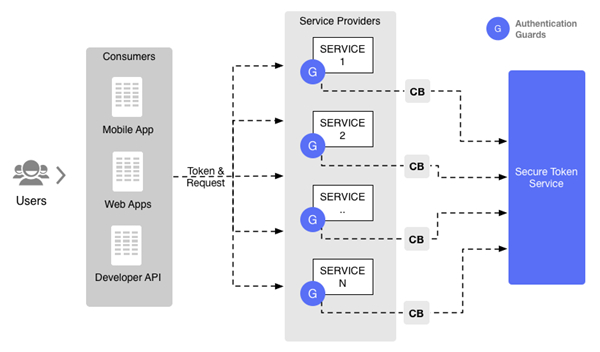
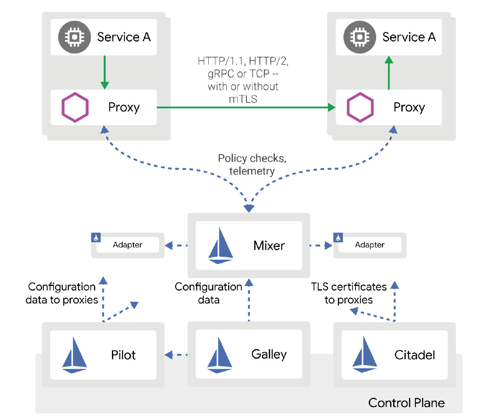

查看原文：<https://blog.aquasec.com/istio-kubernetes-service-mesh>。

2017年5月，谷歌面向大规模容器化应用管理的开源项目Istio正式发布了。此后经过快速的发展，于2018年7月发布了里程碑式的1.0版本。本文的主要内容包括：Istio是什么、Istio的工作原理以及落地方式。在本系列的后续文章中我们还会深入了解Istio的安全和流量管理功能。

#### Istio是什么？

从过去几年发布的大量开源项目中我们可以总结出谷歌内部构建、部署与管理大型分布式容器化应用的方案。而Istio就是这个方案的最后一步——管理应用程序。了解Istio在谷歌内部的起源可以帮你更好的理解它的设计思想和历史背景。

Netflix详细的介绍过混沌工程实践以及故障注入、熔断、限流和链路跟踪等概念。为了避免在每个新项目中都需要重新实现这些功能，开发者一般选择在底层网络实现它们。当前的两种嵌入方式：

1. 把这些功能和公司用到的所有语言的网络库打包到一起，并为所有的服务和团队维护它们。

2. 通过服务网格透明的提供这些功能。Istio使用的就是这种方式。Istio把[Envoy代理](https://www.envoyproxy.io/)作为每个pod的sidecar运行并通过Istio的控制平面来动态的配置Envoy从而实现这些功能。具体如下图所示:

利用基于Envoy的sidecar机制，Istio无需修改应用代码就可以完成嵌入。Envoy代理容器的所有网络流量，而Istio的控制平面可以动态配置Envoy的策略。因此Istio可以在对应用透明的前提下提供诸如TLS双向验证、限流和熔断等功能。

Istio不仅仅是服务网格的解决方案，它还包含另外一个关键概念：服务认证。就像系统通过用户认证来验证用户身份一样，服务也可以像用户一样做认证。我们可以在服务之间建立基于角色的访问控制（RBAC），还能更细粒度的规范服务在网络中的行为。

虽然Istio可以在VM上运行，也可以在Kubernetes集群和VM上扩展，但我们还是主要讨论在Kubernetes环境下的Istio。

#### Istio的优势

- **开箱即用的微服务遥测** 微服务能够通过Istio自动生成遥测平面，无需额外工具就能生成统一的应用指标数据和链路追踪数据。
- **双向TLS** Istio可以在不修改应用的前提下，为服务间调用配置双向TLS认证。 集群内的CA能够为Envoy代理提供必要的证书以保护服务间的流量。
- **红黑部署** 通过在部署期间动态分配应用程序的新老版本之间的流量，我们可以一边观察集群的报错情况，一边将新版本应用逐渐部署到生产环境。
- **丰富的网络策略** 使用Kubernetes我们可以为它的API接口和服务间的网络策略提供RBAC认证。而Istio不仅可以做RBAC认证，它的认证粒度还能限制到HTTP协议的方法和资源路径。

应用开发者能够专注于在7层网络的商业价值而不用浪费时间为基础设施编写重复的解决方案。

#### Istio架构

Istio由数个管理组件的控制平面和控制平面控制的与Envoy sidecar一起运行的服务集合构成。控制平面由以下几个组件组成：

- **Pilot:** 管理和维护所有的Envoy代理中的各种路由规则和RBAC配置。
- **Mixer:** 进行遥测数据采集和执行访问控制/使用策略。
- **Citadel:** 负责颁发和更新TLS证书。
- **Galley:** 它和用户关系不大，主要负责收集和验证系统其他组件的用户配置。
- **Proxy:** Envoy作为每个Kubernetes pod的sidecar代理运行可以提供动态服务发现，负载均衡，TLS认证，RBAC，HTTP和gRPC代理，熔断，健康检查，滚动更新，故障注入和遥测数据。
- **Gateway:** 网关可以作为集群ingress或egress的负载均衡边缘代理。ingress规则可以通过路由规则进行配置。

#### 落地Istio过程中的经验

虽然使用Istio能带来立竿见影的好效果，但要想将它的优势发挥到最大，还必须要有设计良好的微服务架构。好的微服务系统，应该是由多个团队维护的多个小服务。所以它需要团队和业务进行转型，而这点往往容易被忽略。

如之前所说，不管您的应用程序的设计或成熟度如何，都能从Istio中获益。

提高可观察性有助于解决微服务设计中的问题。在迁移、重构或整合项目时使用Istio是有好处的，而在设计良好的微服务项目环境中使用，会让Istio大放异彩。 但请记住，增加任何组件都会增加系统的复杂度。

安装Istio包括安装控制平面组件和配置Kubernetes的pod将所有流量由Envoy代理两步组成。Istio的命令行工具*istioctl*的[*kube-inject*](https://www.aquasec.com/about-us/careers/)命令可以在部署时修改你的YAML配置来给pod增加Envoy代理。另一种使用Istio的方式就是[*webhook admission controller*](https://kubernetes.io/docs/admin/admission-controllers)，它可以在部署时自动的添加Envoy代理，你可以在应用完全无感知的情况下获得Istio的所有好处。

我推荐先装不含任何功能的Istio，然后将各个功能逐渐的用起来，一次做的太多调试起来会比较麻烦。就像Istio团队在推广时所说："Istio是个菜谱"，你不需要一下就把Istio全部用起来。 据以往的经验，从默认的遥测功能开始使用Istio是个不错的选择。

#### Istio安全性

Istio真正的亮点是服务认证，RBAC认证和端到端的双向TLS认证。在本系列的后续文章会详细介绍这方面内容。

#### 总结

Istio区别于Hystrix，它采用服务网格的设计方案。因此落地和运维都变得更加简单。Istio为服务无感知的增加了流量控制和安全性，如果想发挥它的最大效益，还需要设计良好的微服务架构。即使是非常老旧的项目也能在Istio的遥测技术和安全性上获益。
