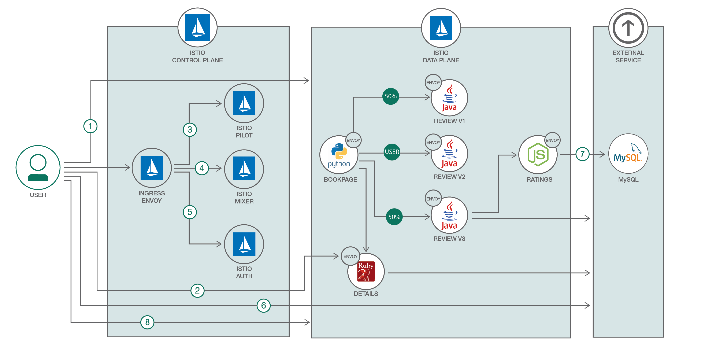

查看原文：<https://developer.ibm.com/code/patterns/manage-microservices-traffic-using-istio/>。

## 说明

开发人员正在摆脱大型单体应用的束缚，转而采用小巧而专一的微服务，以加速软件开发并加强系统弹性。为了满足这个新生态的需求，开发人员需要为部署的微服务创建一个具有负载均衡、高级流量管理、请求跟踪和连接功能的服务网络。

## 概述

如果您花时间开发过应用程序，那么有件事情您肯定明白：单体应用正成为过去。当今的应用程序都是关于服务发现、注册、路由和连接。这给微服务的开发和运维人员提出了新的挑战。

如果您的服务网格在规模和复杂性上不断增长，您可能想知道如何理解和管理服务网格。我们也遇到了同样的问题：如何使这些越来越多的微服务能够彼此连接、负载均衡并提供基于角色的路由？如何在这些微服务上启用传出流量并测试金丝雀部署？仅仅创建一个独立的应用程序还不够，所以我们该如何管理微服务的复杂性呢？

Istio 是 IBM、Google 和 Lyft 合作创建的项目，旨在帮助您应对这些挑战。Istio 是一种开放技术，它为开发人员提供了一种这样的方式：无论是什么平台、来源或供应商，微服务之间都可以无缝连接，服务网格会替您管理和保护微服务。在下面的开发之旅中，您将了解如何通过 Istio 基于容器的 sidecar 架构提供复杂的流量管理控制功能，它既可用于微服务之间的互通，也可用于入口和出口流量。您还将了解如何监控和收集请求跟踪信息，以便更好地了解您的应用流量。此次开发者之旅对于所有使用微服务架构的开发人员来说都是理想之选。

## 流程

1. 用户在 Kubernetes 上部署其配置的应用程序。应用程序 `BookInfo` 由四个微服务组成。该应用中的微服务使用不同的语言编写——Python、Java、Ruby 和 Node.js。`Reivew` 微服务使用 Java 编写，有三个不同的版本。
2. 为了使应用程序能够利用 Istio 的功能，用户将向微服务中注入 Istio envoy。Envoy 使用 sidecar 的方式部署在微服务中。将 Envoy 注入到微服务中也意味着使用 Envoy sidecar 管理该服务的所有入口和出口流量。然后用户访问运行在 Istio 上的应用程序。
3. 应用程序部署完成后，用户可以为示例应用程序配置 Istio 的高级功能。要启用流量管理，用户可以根据权重和 HTTP 标头修改应用的服务路由。在该阶段，`Review` 微服务的 v1 版本和 v3 版本各获得 50％ 的流量；v2 版本仅对特定用户启用。
4. 用户配置服务的访问控制。为了拒绝来自 v3 版本的 `Review` 微服务的所有流量对 `Rating` 微服务的访问，用户需要创建 Mixer 规则。
5. 完成应用程序的部署和配置后，用户可以启用遥测和日志收集功能。为了收集监控指标和日志，用户需要配置 Istio Mixer 并安装所需的 Istio 附件 Prometheus 和 Grafana。要收集 trace span，用户需要安装并配置 Zipkin 附件。
6. 用户为 `Bookinfo` 创建一个外部数据源；例如 IBM Cloud 中的 Compose for MySQL 数据库。
7. 原始示例 `BookInfo` 应用程序中的三个微服务——`Details`、`Ratings` 和 `Review` ，已修改为使用 MySQL 数据库。要连接到 MySQL 数据库，需要在 `Details` 微服务中添加了一个 MySQL Ruby gem；向 `Ratings` Node微服务中添加 MySQL 模块。将 `mysql-connector-java` 依赖项添加到 `Reviews` 微服务 v1、v2 和 v3 版本中。
8. 用户部署应用程序并启用具有出口流量的 Envoy 代理。Envoy 代理作为 sidecar 跟每个微服务部署在一起。Envoy sidecar 将管理该服务中所有流入和流出的流量。当前情况下，由于 Envoy 仅支持 http/https 协议，因此通过提供 MySQL 的 IP 地址范围，代理配置将不会拦截到 MySQL 连接的流量。当应用程序启动后，用户可以使用 IP 和节点端口访问应用程序。

查看该示例中的代码：https://github.com/IBM/microservices-traffic-management-using-istio
