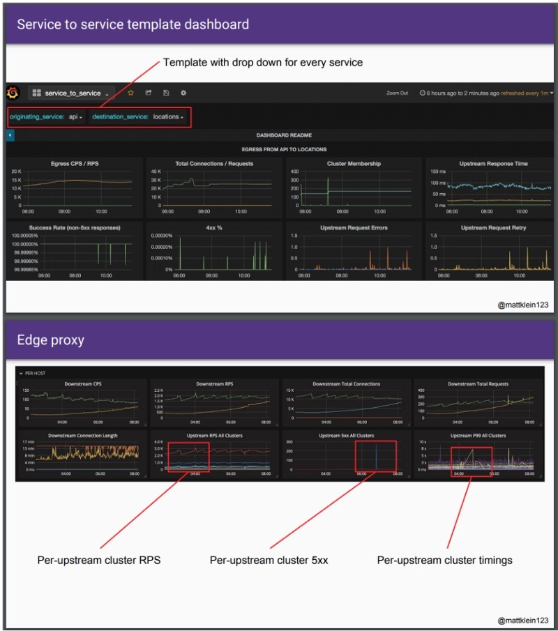
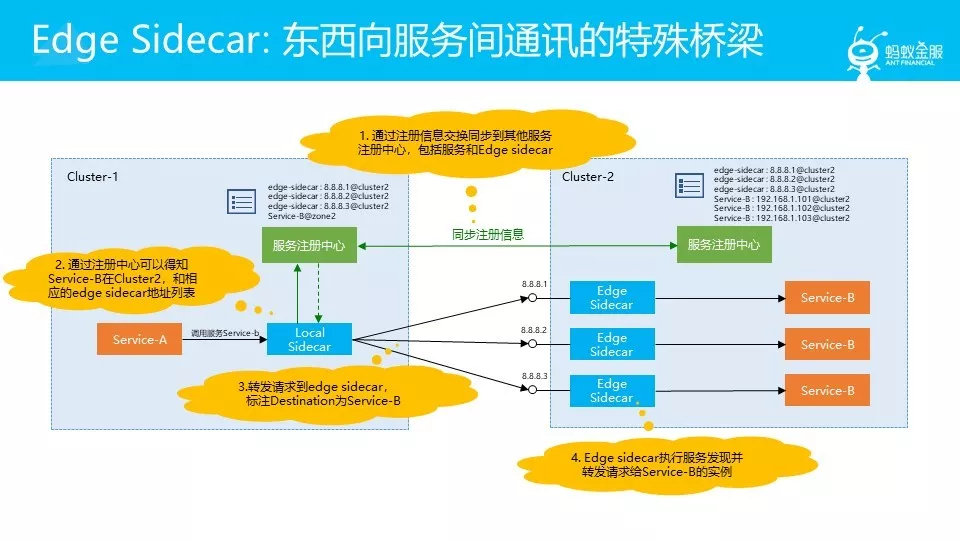

查看原文：<https://dzone.com/articles/the-importance-of-control-planes-with-service-mesh>。

本文将带您了解为什么服务网格和边缘代理如此重要以及它们与持续交付的关系。

了解现代云架构如何使用微服务具有的许多优势，使开发人员能够以CI/CD方式交付业务软件。

去年，Matt Klein写了一篇精彩的博客“[服务网格中的数据平面与控制平面](https://blog.envoyproxy.io/service-mesh-data-plane-vs-control-plane-2774e720f7fc)”。尽管我已经很熟悉“控制面板”这个术语，Matt再次加深了我对这个概念的理解以及与软件持续交付有关的重要性，特别是在入口/边缘网关和服务网格周围的部署控制（和细微差别）方面。

我之前写过关于边缘代理和API网关在软件交付中可以发挥的作用，持续交付：API网关有什么作用？像Envoy这样的现代代理在“云原生”应用程序操作中所产生的影响，我们进行了几次讨论。我得出的结论是，尽管微服务为具有动态编排的容器和云技术的使用提供了新的机会，但是剩下的核心挑战就是控制平面必须进行调整才能跟上变化。

## 控制平面和角色

在Matt的文章中，他指出服务网格控制平面“为网格中所有正在运行的数据平面提供策略和配置”，并且“控制平面将所有数据平面转变为分布式系统。”最终，控制平面的目标是设置将由数据平面制定的策略。控制平面可以通过配置文件，API调用和用户界面来实现。选择的实现方法通常取决于用户的角色，以及他们的目标和技术能力。例如，产品所有者可能想要在应用程序中发布新功能，这里UI通常是最合适的控制平面，因为这可以显示系统的可理解视图并且还提供一些导轨。但是，对于想要配置一系列低级防火墙规则的网络运维人员，使用CLI或配置文件将提供更细粒度（高级用户风格）控制，并且还便于自动化。

控制平面的选择也可能受所需控制范围的影响。我的同事[Rafi之前在QCon SF讨论过这个问题](https://www.infoq.com/news/2017/11/service-oriented-development)，集中或分散运维的要求肯定会影响控制平面的实施。这也直接关系到控制影响应该是本地的还是全局的。例如，运维团队可能希望指定全局合理的默认值和安全措施。但是，在前线工作的开发团队需要对其本地服务进行细粒度控制，并且可能（如果他们正在接受“自由和责任”模式）覆盖安全措施的能力。Matt还在最近的[QCon纽约演讲](https://www.infoq.com/news/2018/07/qcon-klein-service-mesh)中谈到了本地/全局互动，并展示了Lyft团队为服务到服务和边缘/入口代理创建的仪表板：

 

## 东西向流量与南北向流量

软件应用中流量有两种典型分类，其中之一是南北向流量，通常称为入口流量，流量流向外部系统或者外部服务调用内部系统。另外一个是东西向流量，通常称为数据中心内部流量，这是在（可能是虚拟化的）内部网络边界内流动的流量

所谓东西向，大家能理解吧？东西向指服务间通讯，也就是A服务调用B服务。对应的还有南北向，南北向通常是指从外部网络进来调用服务，如走API Gateway调用服务。在东西向通讯中，我们有时会需要一个比较特殊的途径，比如说在这个图中，我们有两个集群，两个集群各有各自的服务注册中心。我们通过增强Pilot的方式打通两个注册中心，可以知道对方有什么服务。

_图片来自敖小剑的分享_

在现代云原生应用程序中，两个独立的组件通常控制这些流量：API网关或边缘代理处理南北流量，相对的service mesh处理东西向流量。在Kubernetes域内，Ambassador 开源API网关可以处理入口流量，而[Istio](https://istio.io/)开放平台可以处理跨服务流量。

对于南北向和东西向代理组件，底层网络技术可以是相同的（例如使用[Envoy](https://www.envoyproxy.io/)）。但是，控制平面通常是不同的，基于与系统交互的角色。

Ambassador控制面板的主要目标是开发人员，并允许将简单的注释添加到Kubernetes配置中以控制核心部署功能，如路由、金丝雀发布、速率限制。

Istio关注的主要角色是运维人员，并且控制平面允许指定额外的Kubernetes资源以促进流量管理（包括故障注入）、安全（基于角色的访问控制和认证安全）和遥测（包括分布式追踪和各监控指标）。

## 结论：分歧或趋同

Lyft使用Envoy作为边缘代理和service mesh，我还听到有工程师使用Ambassador 来管理服务间（东西向）通信的报道，以及Istio处理入口流量（甚至在[v1.0发布](https://www.infoq.com/news/2018/08/istio-1.0-service-mesh)的新网关功能之前），然而，目前Ambassador和Istio所代表的代理技术控制平面的两种方法似乎为开发和运维各自的角色提供了好处。鉴于我们对现代容器网络的整体知识和经验状况，我还不确信有一个简单的一刀切解决方案。因此，我认为在用于管理南北和东西流量的统一控制平面终极解决方案出现之前可能出现分歧。
