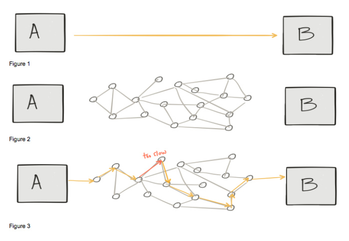

查看原文：<https://www.infoworld.com/article/3273547/containers/the-rise-of-the-istio-service-mesh.html>。

如何确保微服务之间网络通信的可靠性、安全性和可管理性？ 使用服务网格吧！

在过去一年中，[Istio](https://istio.io/)服务网格技术引发关注度和吸引力的持续提升，这是一件非常有趣的事情。 事实上，在我写这篇文章时，Istio仅为0.8版本，但对于最近两届[KubeCon/CloudNativeCon](https://events.linuxfoundation.org/events/kubecon-cloudnativecon-europe-2018/)活动而言，它一直是[热门话题](https://events.linuxfoundation.org/events/kubecon-cloudnativecon-europe-2018/program/schedule/)，仅在丹麦的活动中就有超过十几个不同的活动议题。 那么它为什么会这样受欢迎？

在深入研究Istio受欢迎的原因之前，让我们先来介绍一下服务网格。 这是一个通用术语，其早已被投入在多个不同场景中。例如定义不同无线设备之间的通信方法；或者定义一个系统，各个应用程序可以直接通过它与其他应用程序通信。[最近](https://istio.io/docs/concepts/what-is-istio/overview.html)，这个术语被用来表示应用或微服务的网络，以及它们之间的互相作用关系。后者是本文的重点。

事实上红帽公司一直参与云原生和微服务领域建设，包括四年前决定将OpenShift向Kubernetes和Docker转变，这帮助我们理解了服务网格技术，尤其是Istio的重要性。本文将探讨为什么我会坚信Istio会很受欢迎的四个原因。 

## 微服务和转型

纵观你整个职业生涯，或者结合如今的工作，你可能已经发现从代码完成开发到部署至生产之间的时间不断被延长，以至于开发资源被转移到其他项目，同时也使你的产品反馈周期变得无效或无关紧要。为了缩短交付时间，一些公司决定以功能服务架构或微服务架构来将大型应用拆散，以此提高效率。即曾经具有多种功能的单个应用程序（包）被切分成可独立更新的单个程序包。

这当然是有价值的，但同时也要承认，使用这种架构需要对单独的服务和它们之间的接口进行更多的开发治理。例如曾经定义在应用程序内部的一部分API调用关系现在上升在到网络层中。

Christian Posta的演讲“[微服务中最困难的部分：调用你的服务](https://www.slideshare.net/ceposta/the-hardest-part-of-microservices-calling-your-services)”谈到了一个重要问题。当调用API时，你可能会认为你在处理A和B之间的直接集成调用（下图1）。然而计算机网络并不会针对直接通信进行优化（下图2）。因此在某些情况，尤其当应用处于你正考虑或使用的云环境中时，你不可避免且不得不考虑这些不同的失控物理和虚拟网络设备。例如，就可能存在这样一种情况：其中一台设备的性能低于最佳性能，这将影响整个应用程序的响应时间（下图3）。

 

## 微服务先驱和Netflix OSS

有些公司似乎是为了云计算而生的。为了在云中提供弹性服务，应用程序不得不保护自己免受环境异常影响。

Netflix构建并随后[开源](https://netflix.github.io/)了一系列涉及诸如断路、边缘路由、服务发现和负载均衡等功能的Java技术解决方案。这些组件使应用能够更好地控制通信，从而提高整体可用性。为了测试并确保组件的弹性，Netflix还使用了[混沌工程](http://principlesofchaos.org/)，通过将各种现实中可能存在的问题注入到应用程序的网络中，以便能在任何给定时间中断工作流。 Netflix开发的技术组合允许其应用程序投入到一个以应用程序为中心的网络中，这实际上就是服务网格。

在构建Netflix OSS堆栈的时代，虚拟机是在云中运行应用程序的唯一方式。因此Netflix选择Java作为开发语言来构建服务网格功能。

除了Netflix OSS堆栈的纯Java依赖，另一个挑战是为了实现服务网格功能，开发人员必须将Java库包含在其应用程序中，并在代码中引用来使用这些组件。但在当时，那些希望强制使用这些技术的公司无法在平台级进行如上工作。

随着[Kubernetes](https://www.infoworld.com/article/3268073/containers/what-is-kubernetes-container-orchestration-explained.html)的来临，诸如服务发现和负载均衡等功能成为平台本身的一部分，并且平台允许用任何语言编写的应用程序都可以使用。通过声明式和活动状态管理，Kubernetes还能够通过自动重启无响应的应用来提高整体应用的可用性。在当今世界，Kubernetes和容器是运行微服务应用程序的标准。

在Kubernetes中，你的应用程序以由一个或多个容器组成“pod”运行。在pod中运行多个容器的技术有时也被称为“sidecar”，其实质上是一种将你的应用程序拆散，将子模块运行在共享隔离空间（pod）的解决方案。

Kubernetes为Istio这样的技术的崛起创造了有利条件。出行共享公司Lyft已经开始通过智能代理[Envoy](https://github.com/envoyproxy/envoy)来提供微服务部署所需的弹性和动态路由功能。 sidecar容器和Envoy这类架构允许为每个应用程序实例附加一个轻量级代理，以支持服务发现、负载均衡、断路器、链路跟踪以及服务网格的其他功能。将它与一个控制面板结合，并添加服务治理和Envoy实例配置管理功能，你就拥有了Istio。

## 拥抱分布式架构

最后，Istio和服务网格通常与“拥抱”[分布式计算的谬论](https://en.wikipedia.org/wiki/Fallacies_of_distributed_computing)有关。 换而言之，”**Istio允许应用程序假定网络是可靠的、快速的、安全的、不变的等等——这使得分布式计算的谬论不再是谬论** “。说Istio和Kubernetes可以解决所有这些问题，但忽视这些谬论可能导致企业犯大错误。 企业必须接受这样一个事实：当你有多个微服务和功能服务互相交互时，你就处理分布式系统。

请参阅下面的分布式计算谬论的完整列表以及Istio的解决方案：

| 谬论       | Istio的解决方案               |
| ---------- | ----------------------------- |
| 可靠网络   | 断路和负载均衡                |
| 延迟为零   | 超时和重试                    |
| 忽略带宽   | 服务评级和限制                |
| 安全网络   | 相互TLS                       |
| 拓扑不可改 | 服务发现                      |
| 单一管理员 | 基于角色的访问控制            |
| 零传输成本 | gRPC和Protobuf                |
| 同质化网络 | 动态路由，A/B测试和金丝雀部署 |

在我与OpenShift客户的沟通中，我经常发现他们由于自身需求，已经实现了类似Netflix模式的功能。我也对实现这些功能的团队很有兴趣，经常听到他们说“我们是断路小组”或“我们是服务发现小组”。

创建自己的服务网格功能的公司现在有机会使用Kubernetes和Istio。通过使用这些被标准化的开源技术，他们可以获得由大型社区开发的功能、整理知识和用例，并帮助他们实现更具弹性的应用程序，同时以更低的成本更快地将产品推向市场。

作者Diogenes Rettori是[红帽OpenShift](https://www.redhat.com/en/technologies/cloud-computing/openshift)的主任产品经理。在加入OpenShift团队之前，他专注于红帽JBoss中间件的客户培训。 Diogenes拥有强大的工程背景，曾为爱立信和IBM等公司工作。
